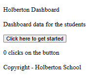

Task0

1) task_0/package.json

```bash
{
  "name": "task_0",
  "version": "1.0.0",
  "private": true,
  "description": "Holberton Webpack task 0",
  "scripts": {
    "dev": "webpack --mode=development",
    "build": "webpack --mode=production"
  },
  "dependencies": {
    "jquery": "^3.7.1"
  },
  "devDependencies": {
    "webpack": "^5.94.0",
    "webpack-cli": "^5.1.4"
  }
}
```

1) task_0/src/index.js

```bash
import $ from 'jquery';

$('body').append('<p>Holberton Dashboard</p>');
$('body').append('<p>Dashboard data for the students</p>');
$('body').append('<p>Copyright - Holberton School</p>');

1) task_0/dist/index.html
<!DOCTYPE html>
<html lang="en">
  <head>
    <meta charset="utf-8" />
    <title>Holberton Dashboard</title>
    <meta name="viewport" content="width=device-width, initial-scale=1" />
  </head>
  <body>
    <!-- Webpack will generate dist/main.js from src/index.js -->
    <script src="main.js"></script>
  </body>
</html>
```


1) Ouvrir un terminal dans Webpack/task_0

Assure-toi que tu es dans le dossier correct :
```bash
cd Webpack/task_0
```

2) Installer les dépendances

Si ce n’est pas déjà fait :

```bash
npm install
```

Cela installera :

webpack et webpack-cli → devDependencies

jquery → dependencies

3) Lancer Webpack pour générer dist/main.js

En développement :

```bash
npx webpack --mode development
```

Ou en production :
```bash
npx webpack --mode production
```

⚡ Le main.js sera créé automatiquement dans le dossier dist/.

4) Ouvrir le projet dans le navigateur

Ouvre dist/index.html directement :

```bash
xdg-open dist/index.html
```

(Sous Windows : double-clique sur le fichier dist/index.html.)

5) Vérifier le résultat

Trois paragraphes s’affichent sur la page.

La console ne doit afficher aucune erreur.

Un seul script est chargé : main.js.

Si tu veux éviter de retaper la commande à chaque fois, tu peux ajouter dans package.json :
```bash
"scripts": {
  "start": "webpack --mode development"
}
```

Puis lancer :

```bash
npm run start
```

terminal de commande
```bash
root@UID7E:/mnt/d/Users/steph/Documents/5ème_trimestre/holbertonschool-web_react/Webpack# ./create_empty_files.sh
✓ task_1/js/dashboard_main.js
✓ task_1/package.json
✓ task_1/webpack.config.js
✓ task_1/public/index.html
✓ task_2/package.json
✓ task_2/css/main.css
✓ task_2/webpack.config.js
✓ task_2/js/dashboard_main.js
✓ task_2/public/index.html
✓ task_3/modules/body/body.css
✓ task_3/modules/body/body.js
✓ task_3/modules/footer/footer.css
✓ task_3/modules/footer/footer.js
✓ task_3/modules/header/header.css
✓ task_3/modules/header/header.js
✓ task_3/package.json
✓ task_3/webpack.config.js
Tous les fichiers vides ont été créés.
root@UID7E:/mnt/d/Users/steph/Documents/5ème_trimestre/holbertonschool-web_react/Webpack# cd task_0
root@UID7E:/mnt/d/Users/steph/Documents/5ème_trimestre/holbertonschool-web_react/Webpack/task_0# np
m install

added 120 packages, and audited 121 packages in 16s

18 packages are looking for funding
  run `npm fund` for details

found 0 vulnerabilities
root@UID7E:/mnt/d/Users/steph/Documents/5ème_trimestre/holbertonschool-web_react/Webpack/task_0# npx webpack --mode development
asset main.js 319 KiB [emitted] (name: main)
runtime modules 937 bytes 4 modules
cacheable modules 279 KiB
  ./src/index.js 190 bytes [built] [code generated]
  ./node_modules/jquery/dist/jquery.js 279 KiB [built] [code generated]
webpack 5.101.3 compiled successfully in 389 ms
root@UID7E:/mnt/d/Users/steph/Documents/5ème_trimestre/holbertonschool-web_react/Webpack/task_0# xdg-open dist/index.html
[11055:11055:0915/155046.555758:ERROR:zygote_host_impl_linux.cc(101)] Running as root without --no-sandbox is not supported. See https://crbug.com/638180.
root@UID7E:/mnt/d/Users/steph/Documents/5ème_trimestre/holbertonschool-web_react/Webpack/task_0#
```


Task 1:

```bash
root@UID7E:/mnt/d/Users/steph/Documents/5ème_trimestre/holbertonschool-web_react/Webpack/task_1# ls
js  package.json  public  webpack.config.js
root@UID7E:/mnt/d/Users/steph/Documents/5ème_trimestre/holbertonschool-web_react/Webpack/task_1# npm init -y
Wrote to /mnt/d/Users/steph/Documents/5ème_trimestre/holbertonschool-web_react/Webpack/task_1/package.json:

{
  "name": "task_1",
  "version": "1.0.0",
  "private": true,
  "description": "Holberton Webpack task 1",
  "scripts": {
    "build": "webpack --config webpack.config.js"
  },
  "dependencies": {
    "jquery": "^3.7.1",
    "lodash": "^4.17.21"
  },
  "devDependencies": {
    "webpack": "^5.94.0",
    "webpack-cli": "^5.1.4"
  },
  "main": "webpack.config.js",
  "keywords": [],
  "author": "",
  "license": "ISC"
}


root@UID7E:/mnt/d/Users/steph/Documents/5ème_trimestre/holbertonschool-web_react/Webpack/task_1# npm install

added 121 packages, and audited 122 packages in 1m

18 packages are looking for funding
  run `npm fund` for details

found 0 vulnerabilities
root@UID7E:/mnt/d/Users/steph/Documents/5ème_trimestre/holbertonschool-web_react/Webpack/task_1# npm run build

> task_1@1.0.0 build
> webpack --config webpack.config.js

asset bundle.js 88.4 KiB [emitted] [minimized] (name: main) 1 related asset
runtime modules 884 bytes 4 modules
modules by path ./node_modules/lodash/*.js 13.9 KiB
  ./node_modules/lodash/debounce.js 5.96 KiB [built] [code generated]
  ./node_modules/lodash/isObject.js 733 bytes [built] [code generated]
  ./node_modules/lodash/now.js 520 bytes [built] [code generated]
  ./node_modules/lodash/toNumber.js 1.48 KiB [built] [code generated]
  ./node_modules/lodash/_root.js 300 bytes [built] [code generated]
  ./node_modules/lodash/_baseTrim.js 444 bytes [built] [code generated]
  ./node_modules/lodash/isSymbol.js 682 bytes [built] [code generated]
  ./node_modules/lodash/_freeGlobal.js 173 bytes [built] [code generated]
  ./node_modules/lodash/_trimmedEndIndex.js 515 bytes [built] [code generated]
  ./node_modules/lodash/_baseGetTag.js 792 bytes [built] [code generated]
  + 4 modules
./js/dashboard_main.js 708 bytes [built] [code generated]
./node_modules/jquery/dist/jquery.js 279 KiB [built] [code generated]
webpack 5.101.3 compiled successfully in 5913 ms
root@UID7E:/mnt/d/Users/steph/Documents/5ème_trimestre/holbertonschool-web_react/Webpack/task_1#
```



# Task2
```bash
root@UID7E:/mnt/d/Users/steph/Documents/5ème_trimestre/holbertonschool-web_react/Webpac
k/task_2# npm install
npm warn deprecated inflight@1.0.6: This module is not supported, and leaks memory. Do not use it. Check out lru-cache if you want a good and tested way to coalesce async requests by a key value, which is much more comprehensive and powerful.
npm warn deprecated rimraf@2.7.1: Rimraf versions prior to v4 are no longer supported
npm warn deprecated glob@7.2.3: Glob versions prior to v9 are no longer supported
npm warn deprecated stable@0.1.8: Modern JS already guarantees Array#sort() is a stable sort, so this library is deprecated. See the compatibility table on MDN: https://developer.mozilla.org/en-US/docs/Web/JavaScript/Reference/Global_Objects/Array/sort#browser_compatibility
npm warn deprecated uuid@3.4.0: Please upgrade  to version 7 or higher.  Older versions may use Math.random() in certain circumstances, which is known to be problematic.  See https://v8.dev/blog/math-random for details.

added 477 packages, and audited 478 packages in 1m

73 packages are looking for funding
  run `npm fund` for details

25 vulnerabilities (1 moderate, 24 high)

To address issues that do not require attention, run:
  npm audit fix

To address all issues (including breaking changes), run:
  npm audit fix --force

Run `npm audit` for details.
root@UID7E:/mnt/d/Users/steph/Documents/5ème_trimestre/holbertonschool-web_react/Webpac
k/task_2# npm run build

> task_2@1.0.0 build
> webpack

assets by status 159 KiB [cached] 1 asset
runtime modules 1.43 KiB 7 modules
orphan modules 1.1 KiB [orphan] 1 module
modules by path ./node_modules/ 819 KiB
  modules by path ./node_modules/style-loader/dist/runtime/*.js 5.84 KiB
    ./node_modules/style-loader/dist/runtime/injectStylesIntoStyleTag.js 2.42 KiB [built] [code generated]
    ./node_modules/style-loader/dist/runtime/styleDomAPI.js 1.5 KiB [built] [code generated]
    + 4 modules
  modules by path ./node_modules/css-loader/dist/runtime/*.js 2.89 KiB
    ./node_modules/css-loader/dist/runtime/noSourceMaps.js 64 bytes [built] [code generated]
    ./node_modules/css-loader/dist/runtime/api.js 2.25 KiB [built] [code generated]
    ./node_modules/css-loader/dist/runtime/getUrl.js 597 bytes [built] [code generated]
  ./node_modules/jquery/dist/jquery.js 279 KiB [built] [code generated]
  ./node_modules/lodash/lodash.js 531 KiB [built] [code generated]
./js/dashboard_main.js + 1 modules 1.52 KiB [built] [code generated]
./node_modules/css-loader/dist/cjs.js!./css/main.css 1.09 KiB [built] [code generated]

ERROR in ./css/main.css (./node_modules/css-loader/dist/cjs.js!./css/main.css) 5:36-92
Module not found: Error: Can't resolve '../assets/holberton-logo.jpg' in '/mnt/d/Users/steph/Documents/5ème_trimestre/holbertonschool-web_react/Webpack/task_2/css'
resolve '../assets/holberton-logo.jpg' in '/mnt/d/Users/steph/Documents/5ème_trimestre/holbertonschool-web_react/Webpack/task_2/css'
  using description file: /mnt/d/Users/steph/Documents/5ème_trimestre/holbertonschool-web_react/Webpack/task_2/package.json (relative path: ./css)
    using description file: /mnt/d/Users/steph/Documents/5ème_trimestre/holbertonschool-web_react/Webpack/task_2/package.json (relative path: ./assets/holberton-logo.jpg)
      no extension
        /mnt/d/Users/steph/Documents/5ème_trimestre/holbertonschool-web_react/Webpack/task_2/assets/holberton-logo.jpg doesn't exist
      as directory
        /mnt/d/Users/steph/Documents/5ème_trimestre/holbertonschool-web_react/Webpack/task_2/assets/holberton-logo.jpg doesn't exist
 @ ./css/main.css 8:6-98 20:17-24 25:22-29 25:33-47 25:50-64 24:0-68 24:0-68
 @ ./js/dashboard_main.js 3:0-25

webpack 5.101.3 compiled with 1 error in 9976 ms
root@UID7E:/mnt/d/Users/steph/Documents/5ème_trimestre/holbertonschool-web_react/Webpac
k/task_2#
```
