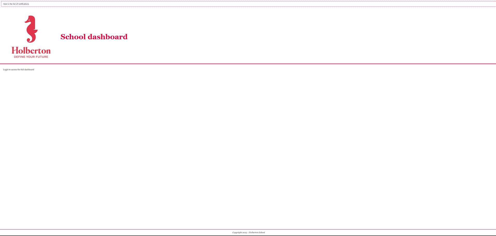
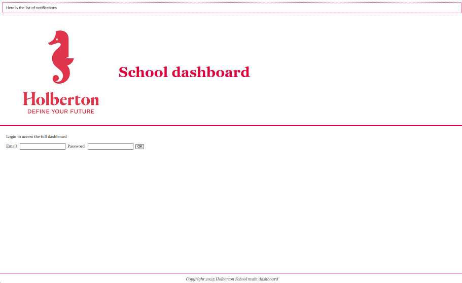

# react_intro

```bash
# depuis react_intro
cd task_0/dashboard

# installe les dépendances (à faire une fois ou si package.json a changé)
npm install

# démarre le serveur Vite
npm run dev


http://localhost:5173/

```

````bash
root@UID7E:/mnt/d/Users/steph/Documents/5ème_trimestre/holbertonschool-web_react/react_
intro/task_0/dashboard# node testRunner.js
✔ index.html existe
✔ public/holberton-logo.jpg présent
✔ public/favicon.ico présent
✔ src/assets/holberton-logo.jpg présent
✔ src/assets/close-button.png présent
✔ public/vite.svg supprimé
✔ src/assets/react.svg supprimé
✔ src/index.css supprimé
✔ src/assets/favicon.ico supprimé
✔ index.html: titre exact
✔ index.html: une seule balise icon (trouvé=1)
✔ index.html: icon pointe vers /holberton-logo.jpg
✔ App.jsx: alt="holberton logo"
✔ App.jsx: h1 "School dashboard"
✔ App.jsx: texte de login
✖ App.jsx: footer avec l'année 2025
✔ App.css: contient #e1003c
✔ main.jsx: pas d'import de index.css
✔ package.json: dépendance jest présente
✔ package.json: bloc de config jest présent
NOK
root@UID7E:/mnt/d/Users/steph/Documents/5ème_trimestre/holbertonschool-web_react/react_
intro/task_0/dashboard# node testRunner.js
✔ index.html existe
✔ public/holberton-logo.jpg présent
✔ public/favicon.ico présent
✔ src/assets/holberton-logo.jpg présent
✔ src/assets/close-button.png présent
✔ public/vite.svg supprimé
✔ src/assets/react.svg supprimé
✔ src/index.css supprimé
✔ src/assets/favicon.ico supprimé
✔ index.html: titre exact
✔ index.html: une seule balise icon (trouvé=1)
✔ index.html: icon pointe vers /holberton-logo.jpg
✔ App.jsx: alt="holberton logo"
✔ App.jsx: h1 "School dashboard"
✔ App.jsx: texte de login
✔ App.jsx: footer avec l'année 2025 (ou {year}/getFullYear())
✔ App.css: contient #e1003c
✔ main.jsx: pas d'import de index.css
✔ package.json: dépendance jest présente
✔ package.json: bloc de config jest présent
OK
```

```bash
root@UID7E:/mnt/d/Users/steph/Documents/5ème_trimestre/holbertonschool-web_react/react_
intro/task_0/dashboard# npm run dev

> dashboard@0.0.0 dev
> vite


  VITE v5.4.20  ready in 831 ms

  ➜  Local:   http://localhost:5173/
  ➜  Network: use --host to expose
  ➜  press h + enter to show help
```


# Task1
```bash
npm test
```

```bash
root@UID7E:/mnt/d/Users/steph/Documents/5ème_trimestre/holbertonschool-web_rea
ct/react_intro/task_0/dashboard# npm test

> dashboard@0.0.0 test
> jest --watchAll=false

 PASS  src/App.spec.js (34.853 s)
  App (Task 0)
    ✓ renders the <h1> with text "School dashboard" (70 ms)
    ✓ renders body and footer texts in the right sections (9 ms)
    ✓ renders the Holberton logo image (16 ms)

Test Suites: 1 passed, 1 total
Tests:       3 passed, 3 total
Snapshots:   0 total
Time:        47.468 s
Ran all test suites.
root@UID7E:/mnt/d/Users/steph/Documents/5ème_trimestre/holbertonschool-web_rea
ct/react_intro/task_0/dashboard#

root@UID7E:/mnt/d/Users/steph/Documents/5ème_trimestre/holbertonschool-web_rea
ct/react_intro/task_0/dashboard# npm test

> dashboard@0.0.0 test
> jest --watchAll=false

 PASS  src/App.spec.js (34.009 s)
  App (Task 0)
    ✓ renders the <h1> with text "School dashboard" (66 ms)
    ✓ renders body/footer texts and the logo image (16 ms)

Test Suites: 1 passed, 1 total
Tests:       2 passed, 2 total
Snapshots:   0 total
Time:        47.808 s
Ran all test suites.
root@UID7E:/mnt/d/Users/steph/Documents/5ème_trimestre/holbertonschool-web_rea
ct/react_intro/task_0/dashboard#
```


# Task2

```bash

```

```bash
root@UID7E:/mnt/d/Users/steph/Documents/5ème_trimestre/holbertonschool-web_rea
ct/react_intro/task_1/dashboard# npm install

up to date, audited 542 packages in 6s

82 packages are looking for funding
  run `npm fund` for details

2 moderate severity vulnerabilities

To address all issues (including breaking changes), run:
  npm audit fix --force

Run `npm audit` for details.
root@UID7E:/mnt/d/Users/steph/Documents/5ème_trimestre/holbertonschool-web_rea
ct/react_intro/task_1/dashboard# npm run dev

> dashboard@0.0.0 dev
> vite

Re-optimizing dependencies because vite config has changed

  VITE v5.4.20  ready in 691 ms

  ➜  Local:   http://localhost:5173/
  ➜  Network: use --host to expose
  ➜  press h + enter to show help

```



# Task3

```bash
root@UID7E:/mnt/d/Users/steph/Documents/5ème_trimestre/holbertonschool-web_rea
ct/react_intro/task_2/dashboard# npm install

up to date, audited 542 packages in 8s

82 packages are looking for funding
  run `npm fund` for details

2 moderate severity vulnerabilities

To address all issues (including breaking changes), run:
  npm audit fix --force

Run `npm audit` for details.
root@UID7E:/mnt/d/Users/steph/Documents/5ème_trimestre/holbertonschool-web_rea
ct/react_intro/task_2/dashboard# npm run dev

> dashboard@0.0.0 dev
> vite

Re-optimizing dependencies because vite config has changed

  VITE v5.4.20  ready in 907 ms

  ➜  Local:   http://localhost:5173/
  ➜  Network: use --host to expose
  ➜  press h + enter to show help


```


# Task4

```bash
root@UID7E:/mnt/d/Users/steph/Documents/5ème_trimestre/holbertonschool-web_rea
ct/react_intro/task_2/dashboard# npm test

> dashboard@0.0.0 test
> jest --watchAll=false

 PASS  src/App.spec.js (35.157 s)
  App (Task 2) - sign in form
    ✓ renders two input elements (email and password) (48 ms)
    ✓ renders two labels with texts "Email" and "Password" (12 ms)
    ✓ renders a button with text OK (70 ms)

Test Suites: 1 passed, 1 total
Tests:       3 passed, 3 total
Snapshots:   0 total
Time:        51.633 s
Ran all test suites.
root@UID7E:/mnt/d/Users/steph/Documents/5ème_trimestre/holbertonschool-web_rea
ct/react_intro/task_2/dashboard#

```

# Task5

```bash
root@UID7E:/mnt/d/Users/steph/Documents/5ème_trimestre/holbertonschool-web_react/react_
intro/task_2/dashboard# npm run dev

> dashboard@0.0.0 dev
> vite


  VITE v5.4.20  ready in 415 ms

  ➜  Local:   http://localhost:5173/
  ➜  Network: use --host to expose
  ➜  press h + enter to show help
```


# Task6

```bash
root@UID7E:/mnt/d/Users/steph/Documents/5ème_trimestre/holbertonschool-web_react/react_
intro/task_3/dashboard# npm test

> dashboard@0.0.0 test
> jest --watchAll=false

 PASS  src/utils.spec.js (9.627 s)
 PASS  src/App.spec.js (18.77 s)

Test Suites: 2 passed, 2 total
Tests:       7 passed, 7 total
Snapshots:   0 total
Time:        40.462 s
Ran all test suites.
root@UID7E:/mnt/d/Users/steph/Documents/5ème_trimestre/holbertonschool-web_react/react_
intro/task_3/dashboard#
```

# Task7

```bash
root@UID7E:/mnt/d/Users/steph/Documents/5ème_trimestre/holbertonschool-web_react/react_
intro/task_3/dashboard# npm test

> dashboard@0.0.0 test
> jest --watchAll=false

 PASS  src/App.spec.js (11.884 s)
 PASS  src/Notifications.spec.js (12.377 s)
 PASS  src/utils.spec.js (30.995 s)

Test Suites: 3 passed, 3 total
Tests:       11 passed, 11 total
Snapshots:   0 total
Time:        26.541 s
Ran all test suites.
root@UID7E:/mnt/d/Users/steph/Documents/5ème_trimestre/holbertonschool-web_react/react_
intro/task_3/dashboard#


root@UID7E:/mnt/d/Users/steph/Documents/5ème_trimestre/holbertonschool-web_react/react_
intro/task_3/dashboard# npm install --save-dev @babel/core @babel/preset-react @babel/register

added 20 packages, and audited 562 packages in 4s

82 packages are looking for funding
  run `npm fund` for details

2 moderate severity vulnerabilities

To address all issues (including breaking changes), run:
  npm audit fix --force

Run `npm audit` for details.


```

# Task8

```bash


```

# Task9

```bash


```
