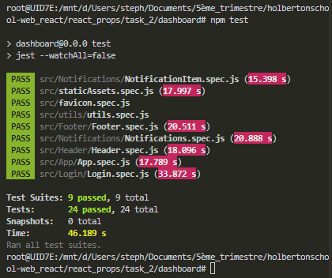

react_props

# Task0
```bash
root@UID7E:/mnt/d/Users/steph/Documents/5ème_trimestre/holbertonschool-web_react/react_prop
s/task_0/dashboard# npm test

> dashboard@0.0.0 test
> jest --watchAll=false

 PASS  src/favicon.spec.js (47.278 s)
 PASS  src/Notifications/Notifications.spec.js (37.999 s)
 PASS  src/staticAssets.spec.js (40.702 s)
 PASS  src/Header/Header.spec.js (45.867 s)
 PASS  src/Login/Login.spec.js (45.142 s)
 PASS  src/utils/utils.spec.js (31.924 s)
 PASS  src/App/App.spec.js (44.446 s)
 PASS  src/Footer/Footer.spec.js (12.921 s)

Test Suites: 8 passed, 8 total
Tests:       20 passed, 20 total
Snapshots:   0 total
Time:        81.851 s
Ran all test suites.
root@UID7E:/mnt/d/Users/steph/Documents/5ème_trimestre/holbertonschool-web_react/react_prop
s/task_0/dashboard#
```


# Task1

```bash

```

# Task2

```bash
root@UID7E:/mnt/d/Users/steph/Documents/5ème_trimestre/holbertonscho
ol-web_react/react_props/task_2/dashboard# npm test

> dashboard@0.0.0 test
> jest --watchAll=false

 PASS  src/Notifications/NotificationItem.spec.js (15.398 s)
 PASS  src/staticAssets.spec.js (17.997 s)
 PASS  src/favicon.spec.js
 PASS  src/utils/utils.spec.js
 PASS  src/Footer/Footer.spec.js (20.511 s)
 PASS  src/Notifications/Notifications.spec.js (20.888 s)
 PASS  src/Header/Header.spec.js (18.096 s)
 PASS  src/App/App.spec.js (17.789 s)
 PASS  src/Login/Login.spec.js (33.872 s)

Test Suites: 9 passed, 9 total
Tests:       24 passed, 24 total
Snapshots:   0 total
Time:        46.189 s
Ran all test suites.
root@UID7E:/mnt/d/Users/steph/Documents/5ème_trimestre/holbertonscho
ol-web_react/react_props/task_2/dashboard#
```


# Task3

```bash

```

# Task4

```bash

```

# Task5

```bash

```
